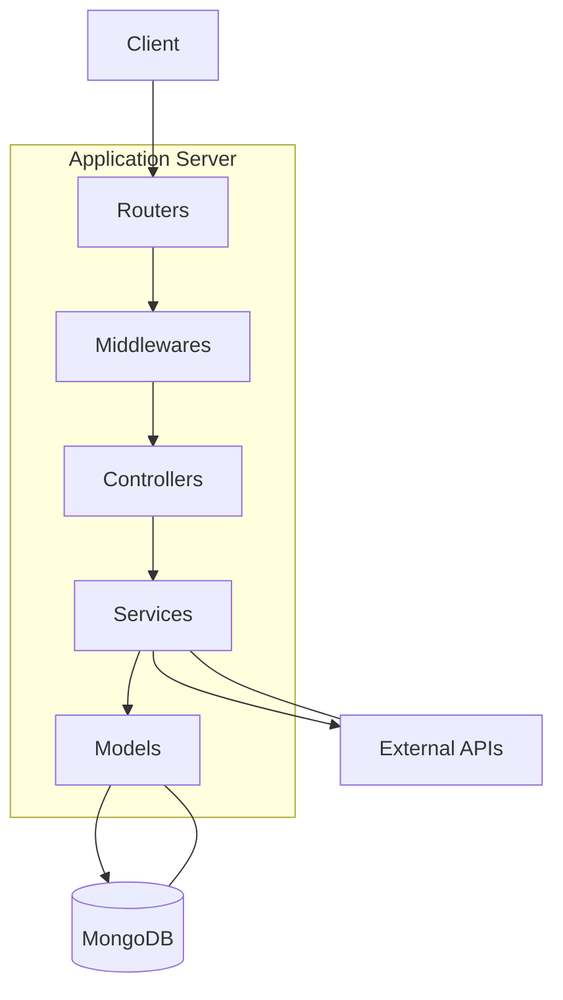

# Project Architecture

This document provides a high-level overview of the CDIC Server application architecture.

## Overview

The application follows a standard layered architecture commonly used in Node.js/Express applications:

-   **Routers (`src/routers`):** Define the API endpoints and direct incoming requests to the appropriate controllers.
-   **Middlewares (`src/middlewares`):** Handle cross-cutting concerns like authentication, authorization, request validation, and error handling.
-   **Controllers (`src/controllers`):** Receive requests from routers, interact with services to perform business logic, and format responses.
-   **Services (`src/services`):** Contain the core business logic, interact with external APIs (like OpenAI, HikerAPI, etc.), and manipulate data using models.
-   **Models (`src/models`):** Define the data structures (using Mongoose schemas) and interact with the MongoDB database.

## Component Diagram (Simplified)

This diagram shows the typical flow of a request through the system layers and the primary dependencies between components. 