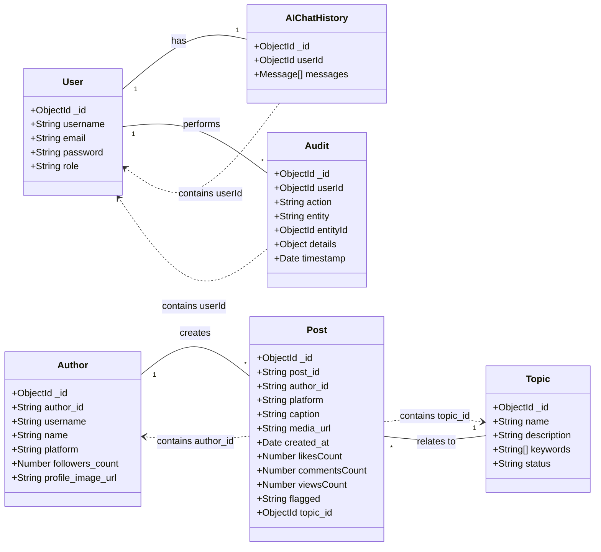

# Data Models (`src/models`)

This section describes the Mongoose data models used in the application to interact with the MongoDB database.

## Available Models

-   [User](./user_model.md): Represents application users.
-   [AIChatHistory](./aiChat_model.md): Stores the history of conversations between users and the AI assistant.
-   [Author](./author_model.md): Represents content creators or social media handles monitored by the system.
-   [Post](./post_model.md): Represents individual pieces of content (e.g., social media posts, articles) collected by the system.
-   [Topic](./topic_model.md): Represents specific subjects or themes tracked within the content.
-   [Audit](./audit_model.md): Records actions performed within the system for auditing purposes.
-   [Comment](./comment_model.md): Represents user comments on posts, often for review purposes.

## Model Relationship Diagram (Simplified)

This diagram shows the primary relationships between the core data models.

*Note: Cardinality (e.g., `1`, `*`) indicates typical relationships (one-to-one, one-to-many). Dotted lines (`..>`) indicate a reference via an ID field.* 