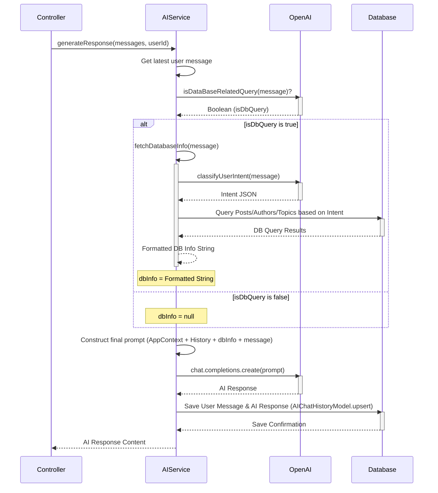

# AI Service (`src/services/ai.service.ts`)

This service is responsible for handling user interactions with the AI chat assistant. It manages chat history, interprets user queries, potentially fetches relevant data from the database, and generates responses using OpenAI.

## Key Responsibilities

-   Maintaining and retrieving user-specific chat history.
-   Classifying user intent to determine if a query relates to database information (posts, authors, topics, statistics) or general assistance/navigation.
-   Fetching structured data from the database (Posts, Authors, Topics) based on classified intent (platforms, timeframe, metrics, filters).
-   Generating conversational responses using OpenAI's models (e.g., `gpt-4o-mini`), incorporating database context when relevant.
-   Providing context to the AI about the Verideck application's features, sections, and navigation URLs.
-   Converting natural language search queries into hashtags.

## Core Functions

-   `getChatHistory(userId: string)`: Retrieves the chat message history for a given user ID from the `AIChatHistory` collection.
-   `classifyUserIntent(message: string)`: Uses OpenAI (`gpt-4o-mini`) to analyze a user message and extract structured information like query type, target platforms, timeframe, metrics, sorting, limits, and filters. Returns a JSON object.
-   `fetchDatabaseInfo(message: string)`: Orchestrates the process of fetching data. It first calls `classifyUserIntent`. Based on the intent, it constructs Mongoose queries (applying timeframe, platform, and other filters) to fetch data from `Post`, `Author`, or potentially `Topic` models. It formats the retrieved data into a string for the AI context.
-   `isDataBaseRelatedQuery(message: string)`: Uses OpenAI (`gpt-4o-mini`) with a specific prompt to determine if a user's message requires fetching information from the application's database. Returns a boolean.
-   `generateResponse(messages: ChatCompletionMessageParam[], userId: string)`: This is the main entry point for generating a chat response.
    1.  Retrieves the latest user message.
    2.  Calls `isDataBaseRelatedQuery` to check if the query needs DB context.
    3.  If it's DB-related, calls `fetchDatabaseInfo` to get relevant data.
    4.  Constructs the final prompt for OpenAI, including:
        *   The application context (`APP_CONTEXT`).
        *   The user's chat history.
        *   The fetched database information (if any).
        *   The current user message.
    5.  Calls the OpenAI API (`gpt-4o-mini`) to generate the chat completion.
    6.  Saves the user message and the AI response to the chat history (`AIChatHistoryModel`).
    7.  Returns the generated response content.
-   `convertSearchQueryToHashtag(searchQuery: string)`: Takes a user's search query and uses OpenAI (`gpt-4o-mini`) to generate a relevant single hashtag (e.g., "covid misinformation" -> "#CovidMisinformation").

## `generateResponse` Sequence Diagram

## Dependencies

-   `openai`: Node.js library for interacting with the OpenAI API.
-   `dotenv`: For loading environment variables.
-   `mongoose`: For database interactions.
-   Models: `AIChatHistoryModel`, `Post`, `Author`, `TopicModel`.
-   Services: `contentSearch.service` (specifically `intelligentSearch`, `getPlatformStatistics` - though these seem unused in the provided snippet, might be used elsewhere or planned). 