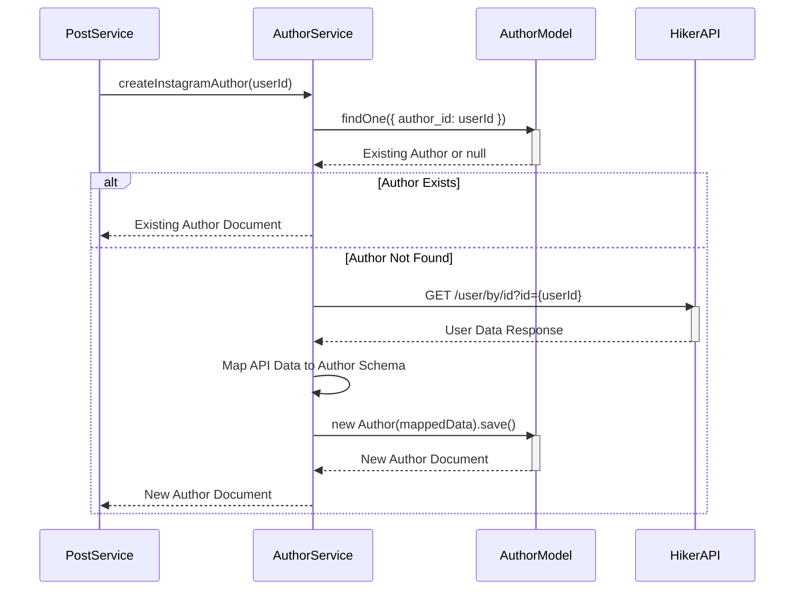

# Author Service (`src/services/author.service.ts`)

Handles the creation, retrieval, and management of author profiles, often involving interaction with external platform APIs.

## Key Responsibilities

-   **Author Creation (Platform Specific):**
    -   Provides functions to create `Author` documents by fetching profile data from external APIs based on a user/channel ID or source name.
    -   Supports Instagram (via HikerAPI), YouTube (via Google API), Twitter (via SocialDataTools API - *needs verification based on `process.env.TWITTER_API_URL`*), and News sources.
    -   Checks if an author with the given platform-specific ID already exists before fetching from the API.
    -   Maps API response fields to the `IAuthor` schema.
-   **Author Retrieval:**
    -   Retrieves a paginated list of all authors (`getAllAuthorsInfo`).
    -   Supports filtering by username (regex search), platform (requires querying `Post` collection), and flagged status.
    -   Enriches author data with the platform they are associated with (by looking up one of their posts).
-   **Author Management:**
    -   Toggles the `flagged` status of an author and updates `flaggedBy` and `flagTimestamp` (`toggleAuthorFlagService`).

## Core Functions

-   `createInstagramAuthor(userId)`: Fetches Instagram user data using HikerAPI and creates/returns an `Author`.
-   `createYoutubeAuthor(channelId)`: Fetches YouTube channel data using Google API and creates/returns an `Author`.
-   `createTwitterAuthor(userId)`: Fetches Twitter user data (API URL/key from env vars) and creates/returns an `Author`.
-   `createNewsAuthor(source: {name, icon})`: Creates/returns an `Author` for a news source (no external API call).
-   `getAllAuthorsInfo(page, limit, search?, platform?, flagged?)`: Retrieves a paginated and filtered list of authors, adding platform information.
-   `toggleAuthorFlagService(authorId, userId)`: Flags or unflags an author. Updates the `flagged` boolean, adds/removes the `userId` from `flaggedBy`, and sets/clears `flagTimestamp`. Returns the updated author.

## Author Creation Flow (Example: Instagram)

## Dependencies

-   `axios`: For making HTTP requests to external APIs.
-   `mongoose`: For database interactions.
-   Models: `Author`, `Post`.
-   Environment Variables: API keys/URLs for HikerAPI, YouTube, Twitter. 