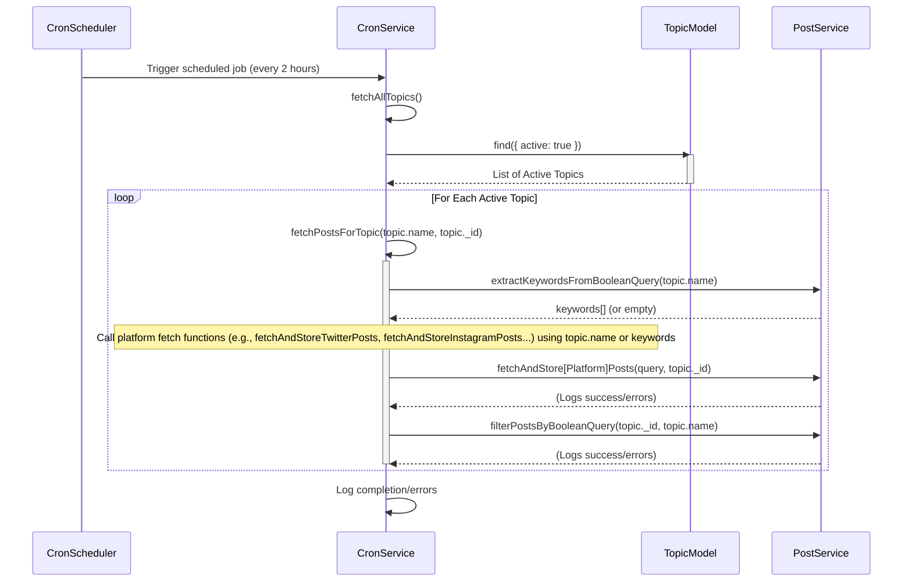

# Cron Service (`src/services/cron.service.ts`)

Manages scheduled background tasks using the `node-cron` library.

## Key Responsibilities

-   Initializing scheduled jobs when the application starts.
-   Periodically fetching posts for all active topics.
-   Coordinating the fetching process across multiple platforms for each topic.
-   Handling potential boolean logic within topic names for fetching and filtering.

## Core Functions

-   `fetchPostsForTopic(topicName, topicId)`: Orchestrates the fetching of posts for a *single* topic.
    -   Attempts to extract keywords from the `topicName` if it contains boolean operators (using `post.service.extractKeywordsFromBooleanQuery`).
    -   Calls platform-specific fetch functions from `post.service` (e.g., `fetchAndStoreTwitterPosts`, `fetchAndStoreInstagramPosts`, etc.).
        -   Uses the full `topicName` for platforms potentially supporting complex queries (Twitter, YouTube).
        -   Uses extracted keywords (or the full name if no keywords extracted) for platforms requiring simpler searches (Instagram, Reddit, Google News), iterating through keywords if necessary.
    -   After fetching, it calls `post.service.filterPostsByBooleanQuery` to potentially remove posts that don't match the original `topicName`'s boolean logic.
    -   Logs errors for each platform fetch attempt but continues processing.
-   `fetchAllTopics()`: Fetches all topics marked as `active: true` from the `TopicModel`.
    -   Iterates through each active topic *sequentially* (to avoid overwhelming external APIs).
    -   Calls `fetchPostsForTopic` for each topic.
-   `initCronJobs()`: Initializes the cron schedule.
    -   Schedules `fetchAllTopics` to run every 2 hours (`0 0 */2 * * *`).
    -   Logs that cron jobs have been initialized.

## Scheduled Fetch Flow (`fetchAllTopics`)

## Dependencies

-   `node-cron`: For scheduling tasks.
-   Models: `TopicModel`.
-   Services: `post.service` (various fetch functions, `extractKeywordsFromBooleanQuery`, `filterPostsByBooleanQuery`). 