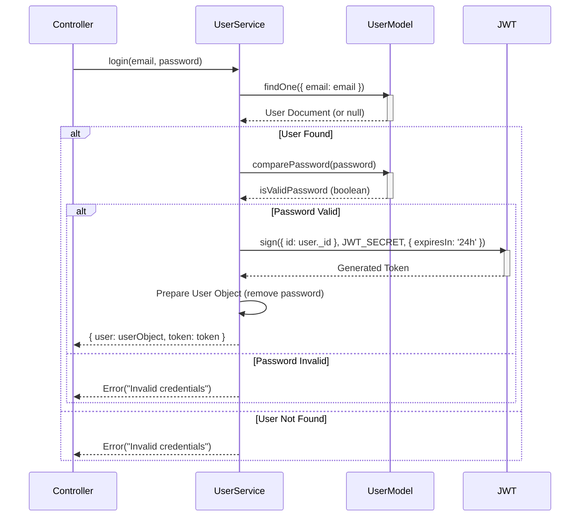

# User Service (`src/services/user.service.ts`)

Provides business logic for user management, including authentication, profile updates, and administrative actions.

## Key Responsibilities

-   Registering new users (checking for existing email, hashing password).
-   Logging users in (finding user, comparing password, generating JWT).
-   Updating user profile information (name, email), ensuring email uniqueness.
-   Updating user passwords (verifying current password, hashing new password).
-   Retrieving a list of all users (excluding passwords).
-   Updating a user's role and name (typically an admin function).
-   Registering new members (similar to `register` but potentially for admin use).
-   Deleting users.

## Core Functions

-   `register(userData)`: Creates a new user. Throws an error if the email already exists. Returns the created user object (without password).
-   `login(email, password)`: Authenticates a user. Finds the user by email, compares the password using the `comparePassword` method on the `User` model. If successful, generates a JWT token valid for 24 hours and returns the user object (without password) and the token.
-   `updateUser(userId, userData)`: Updates the name and/or email for a specific user. Checks for email conflicts if the email is being changed. Returns the updated user object (without password).
-   `updatePassword(userId, passwordData)`: Updates the password for a specific user. Requires the current password for verification. Returns a success message.
-   `getAllUsers()`: Retrieves all user documents from the database, excluding the password field.
-   `updateUserRole({ userId, newRole, name })`: Updates the role and name of a specific user. Returns the updated user object (without password).
-   `registerNewMember(userData)`: Creates a new user, explicitly setting the role (defaults to MEMBER if not provided). Returns the created user object (without password).
-   `deleteUser(userId)`: Deletes a user by their ID. Returns a success message.

## Authentication Flow (`login`)

## Dependencies

-   `jsonwebtoken`: For generating JWT tokens during login.
-   `bcryptjs`: Used implicitly via the `User` model for password hashing and comparison.
-   Models: `User`.
-   Constants: `JWT_SECRET` (from `auth.middleware.ts` - consider defining centrally). 